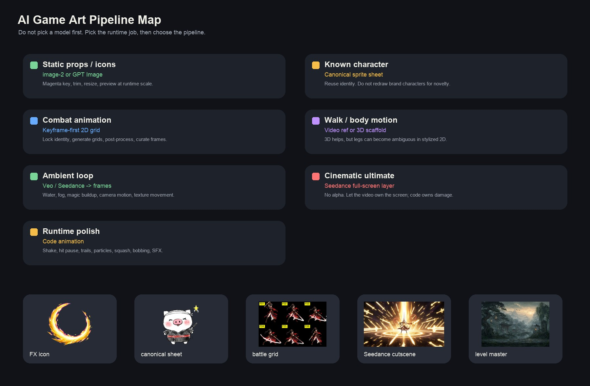
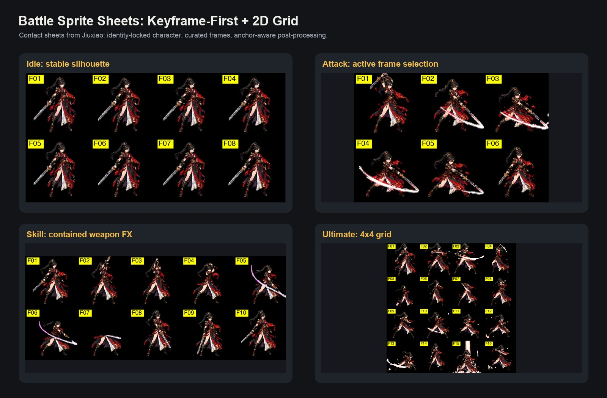
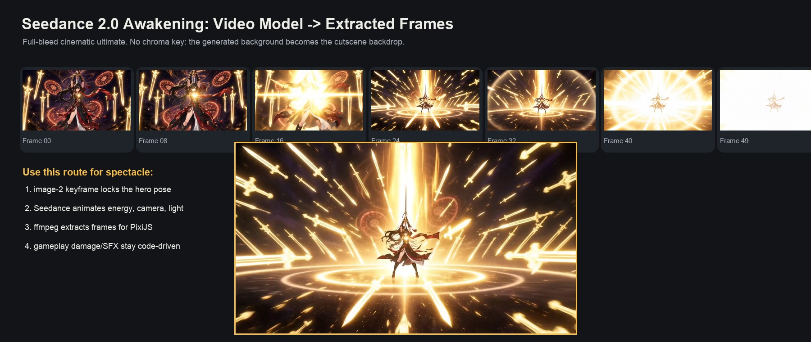
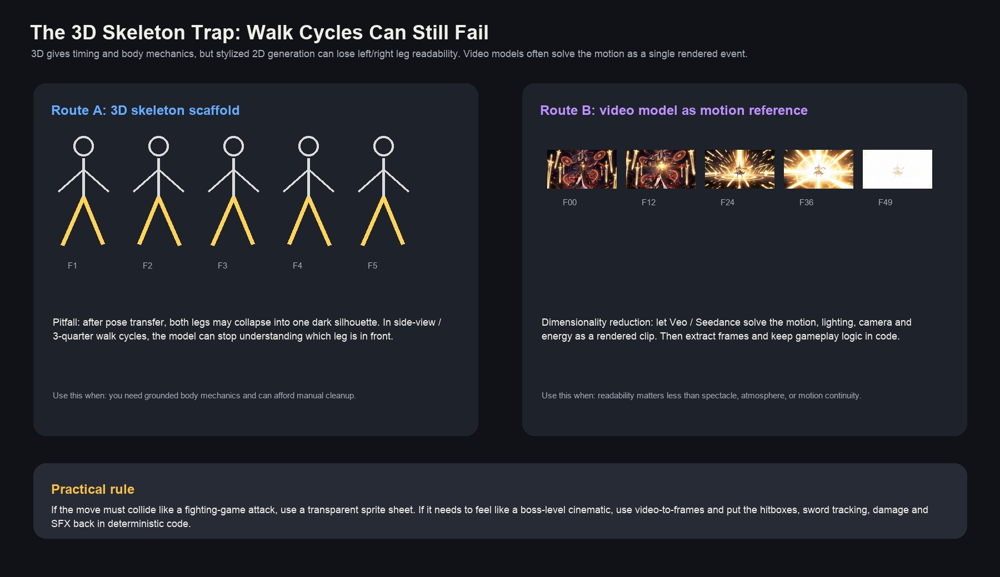

<div align="center">
  
</div>

# AI Game Art Pipeline Skill

> Provider-neutral workflows for turning AI images and videos into playable game assets.

[](https://github.com/ybuild-ai/ai-game-art-pipeline-skill/stargazers)
[](LICENSE)
[](https://github.com/ybuild-ai/ai-game-art-pipeline-skill/commits/main)
[](SKILL.md)

This skill helps agents plan, generate, clean, package, and QA game-runtime art assets: sprites, icons, backgrounds, video-to-frames animation, cinematic ultimates, anchors, compression, and runtime checks.

It is not a prompt pack or a model leaderboard. The point is to ship assets that survive a real game loop.

## Why This Exists

Most AI game art demos stop at a beautiful image. Games need stricter things:

- Transparent sprites that do not jitter.
- Animation frames with stable identity and readable silhouettes.
- Backgrounds that fit mobile GPU texture limits.
- Cinematic effects that look rich without owning gameplay logic.
- Audio, hit timing, anchors, and compression that hold up in runtime.

The core rule:

> Pick the pipeline by runtime job, not by model hype.

## Install

Recommended, if you use the Agent Skills installer:

```bash
npx skills add ybuild-ai/ai-game-art-pipeline-skill --skill ai-game-art-pipeline -g
```

Manual Codex install:

```bash
git clone https://github.com/ybuild-ai/ai-game-art-pipeline-skill.git ~/.codex/skills/ai-game-art-pipeline
```

Manual Claude Code install:

```bash
git clone https://github.com/ybuild-ai/ai-game-art-pipeline-skill.git ~/.claude/skills/ai-game-art-pipeline
```

Then ask your agent for tasks like:

- "Use the AI game art pipeline skill to plan a 2D action RPG sprite pipeline."
- "Generate prompts and post-processing steps for a combat sprite sheet."
- "Turn a cinematic ultimate video into runtime frames and code-owned hit logic."
- "Audit these game assets for mobile runtime shipping risks."

## What You Get

| Runtime job | Recommended route |
|---|---|
| Static props, items, FX icons | Image model + style refs + removable background |
| Existing or brand character | Reuse canonical sprite sheets before regenerating |
| Combat character animation | Keyframe-first + 2D grid + post-processing + curation |
| Walk/run/body mechanics | Prefer video motion reference; use 3D skeleton only when cleanup is acceptable |
| Ambient loops | Video model -> extracted frames |
| Cinematic ultimate / boss intro | Full-screen video-to-frames + code-driven hit logic |
| Runtime feel | Deterministic code: hit pause, shake, particles, trails, SFX |

## Visual Examples

| Combat sprites | Cinematic ultimate |
|---|---|
|  |  |

| Motion reference tradeoff | Pipeline map |
|---|---|
|  |  |

## Repository Layout

```text
SKILL.md
references/
  static-assets.md
  battle-sprites.md
  motion-video.md
  backgrounds.md
  runtime-shipping.md
scripts/
  provider_stub.py
  chroma_key_magenta.py
  sheet_contact.py
  extract_video_frames.py
examples/
  prompts.md
media/
  pipeline-map.jpg
  battle-sprite-grid.jpg
  seedance-awakening-frames.jpg
  skeleton-vs-video-motion.jpg
```

## Bundled Scripts

Scripts are local utilities only. They do not contain API keys, endpoints, private paths, or vendor SDK code.

| Script | Purpose |
|---|---|
| `scripts/provider_stub.py` | Adapter interface users can implement for their own image/video provider |
| `scripts/chroma_key_magenta.py` | Remove solid magenta backgrounds from generated assets |
| `scripts/sheet_contact.py` | Build numbered contact sheets for sprite curation |
| `scripts/extract_video_frames.py` | Extract and resize video frames for runtime texture sequences |

Examples:

```bash
python scripts/chroma_key_magenta.py input.png output.png
python scripts/sheet_contact.py frames/ contact.png --cols 6
python scripts/extract_video_frames.py ultimate.mp4 frames/ --fps 14 --start 0.6 --duration 3.6 --width 1280
```

## Quick Workflow

1. Identify the runtime job and target engine.
2. Check whether canonical assets already exist.
3. Pick the smallest useful vertical slice.
4. Generate or reuse source visuals.
5. Post-process with deterministic scripts.
6. Preview at target size and target device.
7. Iterate surgically: rerun one animation, reprocess raw output, or repack frames.

## Good Fit / Bad Fit

Good fit:

- 2D action RPGs, tactics games, card battlers, mobile games, UI-heavy games.
- Teams using image/video generation but needing runtime-ready assets.
- Agents that can run local scripts and edit asset pipelines.

Bad fit:

- One-off marketing art.
- Pure concept-art exploration with no runtime target.
- Fully automated "make my whole game art set" workflows with no curation.

## Contributing

Contributions are welcome. The most useful additions are:

- New provider adapters that keep credentials outside the repo.
- Runtime preview templates for PixiJS, Canvas, Godot, Unity, SpriteKit, or web games.
- More post-processing utilities for trimming, anchors, packing, and QA.
- Real pipeline notes from shipped projects.

See [CONTRIBUTING.md](CONTRIBUTING.md).

## License

MIT. See [LICENSE](LICENSE).
